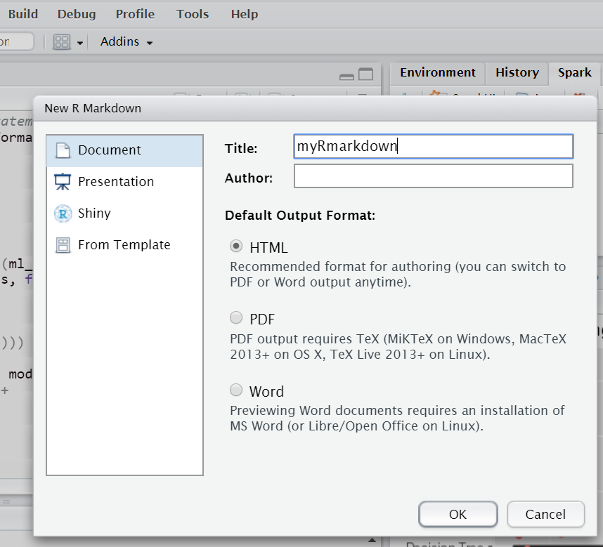

# EMR machine learning with R & spark

## Scenario

When researchers train machine learning or deep learning models, huge amounts of data and multilayer algorithms make the model training slow.
AWS EMR services combine with Spark based memory processing architecture that allows users to do this work in a very short time. 
This experiment mainly leads you to use the R studio in AWS EMR services and Spark to train several machine learning models and to present the results by R flexdachboard package.

## Prerequisites

Make sure you are in US East (N. Virginia), which short name is us-east-1.

Download Putty and PuTTYgen: IF you don’t already have the **PuTTy client/PuTTYgen** installed on your local machine, you can download and then launch it from here:
https://www.chiark.greenend.org.uk/~sgtatham/putty/latest.html

### Create Security Group
In this section, we first create a network security environment that can only be open to R.
1.	On the **Services** menu, click **EC2**.

2.	In the navigation pane, click **Security Groups**.

3.	Click **Create Security Group**.

4.	In the **Create Security Group** dialog box, configure the security group with the following values:

* security Group Name: EMR Security Group
* Description: Security for the EMR
* VPC: No VPC

5.	In Security group rules, select **Inbound** and **Add Rule**. Configure the access rule with the following values:

6.	Click **Create**

### Launch EMR cluster
1. 	In the **AWS Management Console**, on the **service** menu, click **EMR**.

2. 	Click **Create Cluster**.

3. 	Click **Go to advanced options**.

4. 	In Step1: Software and Steps: for Release, choose **EMR 5.3.0** and check the box **Spark2.1.0**. Then **Next**.

5. 	Choose **m4.large** instance and check the **spot** box. Then **Next**.

6.	In General Options page, type Cluster name as **My cluster**, and choose the S3 bucket you want to store log information. Then **Next**.

7.	In Security Options page. Select the **key pair** and **EMR security group** you created. In permissions, select **Custom** and change EC2 instance profile to **mylab_EMR_role**.

8. Type **Create cluster**, it may take some time to launch a EMR cluster. If the status is "waiting", it means you have successfully opened.

### Set Rstudio environment
Choose the EMR cluster you just built and use the specified security group key pair (.pem key) to connect **Master public DNS** of EMR cluster via SSH.

#### Update
	sudo yum update
	sudo yum install libcurl-devel openssl-devel 

#### Install RStudio Server
	wget -P /tmp https://s3.amazonaws.com/rstudio-dailybuilds/rstudio-server-rhel-0.99.1266-x86_64.rpm
	sudo yum install --nogpgcheck /tmp/rstudio-server-rhel-0.99.1266-x86_64.rpm

#### Make Rstudio User
	sudo useradd -m rstudio-user
	sudo passwd rstudio-user
	su rstudio-user

#### Give permission to yarn
	export HADOOP_USER_NAME=yarn

#### Create new directory in HDF
	
HDF (Hierarchical Data Format) is a file format and corresponding library files designed for storing and processing large volume scientific data.

	hadoop fs -mkdir /user/rstudio-user
	hadoop fs -chmod 777 /user/rstudio-user

---
### R Script

#### Set system environment 
	Sys.setenv(SPARK_HOME="/usr/lib/spark")
	config <- list() 

#### Prepare packages

	install.packages("dplyr")
	install.packages("sparklyr")
	install.packages("data.table")
	install.packages("ggplot2")

	library(dplyr)
	library(sparklyr)
	library(data.table)
	library(ggplot2)

#### Install spark and connect to R
Make sure your EMR cluster spark version is 2.1.0 .

	sc <- spark_connect(master = "yarn-client", config = config, version = '2.1.0')

#### Read data from S3 public bucket and write  Parquet files to HDF
Parquet is a high-performance column storage file format, which is better than CSV file, it can query data quickly.
	
	Wine <- fread('https://s3.amazonaws.com/ecv-training-jj-v/wineQualityWhites.csv')

	Wine`$`quality<-as.factor(Wine`$`quality)

	Wine<-Wine[,-1]

	Wine_tbl <- copy_to(sc, Wine)

	spark_write_parquet(Wine_tbl, path="/user/rstudio-user", mode="overwrite", partition_by = "dt")

#### Prepare training and testing data
 
Transform our dataset, and then partition into 'training' and 'test'.

	Wine_partitions <- Wine_tbl %>%
	  sdf_partition(training = 0.7, test = 0.3, seed = 10997)

### Build some machine learning models

	ml_formula <- formula(quality ~ fixed_acidity + volatile_acidity + citric_acid + residual_sugar + chlorides + free_sulfur_dioxide+total_sulfur_dioxide+ density + pH + sulphates + alcohol)

#### Linear Model
	ml_lm <- Wine_partitions$train %>%
	  ml_linear_regression(ml_formula)
#### Random Forest
	ml_rf <- Wine_partitions$train %>%
	  ml_random_forest_classifier(ml_formula)
#### Naive Bayes
	ml_nb <- Wine_partitions$train %>%
	  ml_naive_bayes(ml_formula)
#### Desision Tree
	ml_dt <-  Wine_partitions$train %>%
	  ml_decision_tree(ml_formula)

#### Feature Importance
	ml_models <- list(
	  "Linear" = ml_lm,
	  "Decision Tree" = ml_dt,
	  "Random Forest" = ml_rf,
	  "Naive Bayes" = ml_nb
	)

	feature_importance <- data_frame()

	for(i in c("Decision Tree", "Random Forest")){
	  feature_importance <- ml_tree_feature_importance(ml_models[[i]]) %>%
    mutate(Model = i) %>%
    rbind(feature_importance, .)
	}

	feature_importance %>%
	  ggplot(aes(reorder(feature, importance), importance, fill = Model)) + 
	  facet_wrap(~Model) +
	  geom_bar(stat = "identity") + 
	  coord_flip() +
	  labs(title = "Feature importance",
       x = NULL) +
	  theme(legend.position = "none")

#### Model Comparison

	n <- 10

	format_as_character <- function(x){
	  x <- paste(deparse(x), collapse = "")
	  x <- gsub("\\s+", " ", paste(x, collapse = ""))
	  x
	}

	format_statements <- function(y){
	  y <- format_as_character(y[[".call"]])
	  y <- gsub('ml_formula', ml_formula_char, y)
	  y <- paste0("system.time(", y, ")")
	  y
	}

	ml_formula_char <- format_as_character(ml_formula)

	all_statements <- map_chr(ml_models, format_statements) %>%
	  rep(., n) %>%
	  parse(text = .)

	res <- map(all_statements, eval)

	result <- data_frame(model = rep(names(ml_models), n),
                     time = map_dbl(res, function(x){as.numeric(x["elapsed"])})) 

	result %>%
	  ggplot(aes(time, reorder(model, time))) + 
	  geom_boxplot() + 
	  geom_jitter(width = 0.4, aes(color = model)) +
	  scale_color_discrete(guide = FALSE) +
	  labs(title = "Model training times",
       x = "Seconds",
       y = NULL)

                                

#### Save R.data
In order to present the result to R flexdashboard, we save the data directly. Firstly, run R script below: 

	save(feature_importance,Wine,Wine_tbl,ml_dt, ml_nb, ml_rf, ml_lm, file = '/home/rstudio-user/result.Rdata')

Copy the result to S3 use aws CLI: 

	aws s3 cp /home/rstudio-user/result.Rdata s3://[your bucket name]

### Present analysis result to web dashboard

To save some cost, this session you don't have to run on AWS EMR. You can run on your local and share it with the public R community

#### Install required packages:

	install.packages("flexdashboard")
	install.packages("markdown")

#### R Markdown:

1. Create a new R Markdown script:

2. Pass the following code:
https://github.com/JellalYu/Sparkling-water-machine-learning-with-R-AWS-EMR/blob/master/flexdashboard_sparkonly.txt

3. Type **knit** in Rstudio.

4. Type publish on upper right corner.

 

5. Publish to RPubs.
This is a completely free R community, where you can simply share the results of the analysis.

---
## Conclusion
Congratulations! You now have learned how to:
* Launch an EMR Cluster and run a simple machine learning script via spark in R.
* Share your analytic result to Web dashboard to public R community.

---
## Appendix
If your EMR_DefaultRole or EMR_EC2_DefaultRole is not valid, please refer the following url to resolve:
https://aws.amazon.com/tw/premiumsupport/knowledge-center/emr-default-role-invalid/

